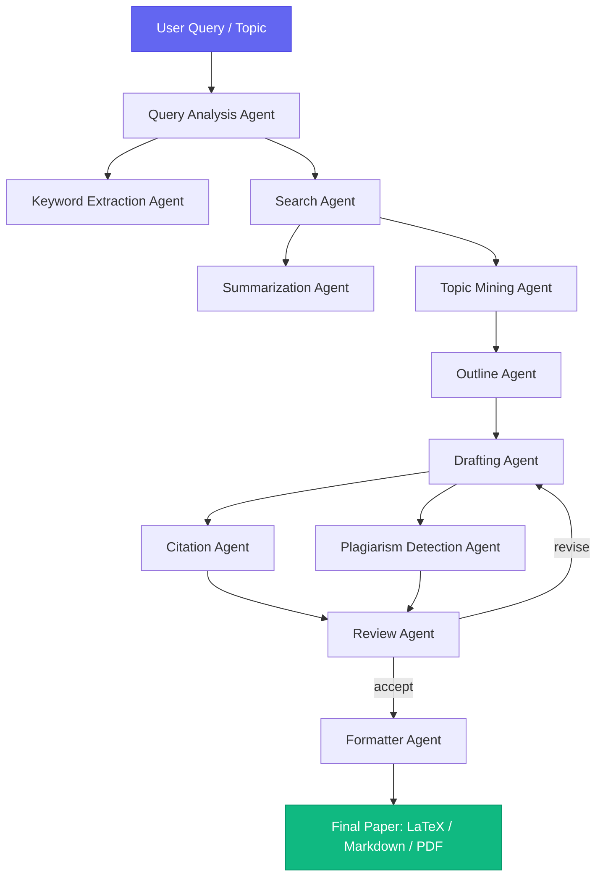
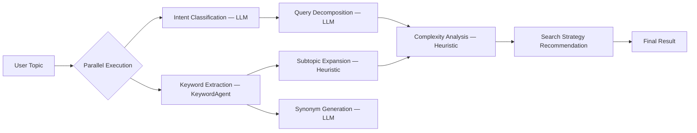
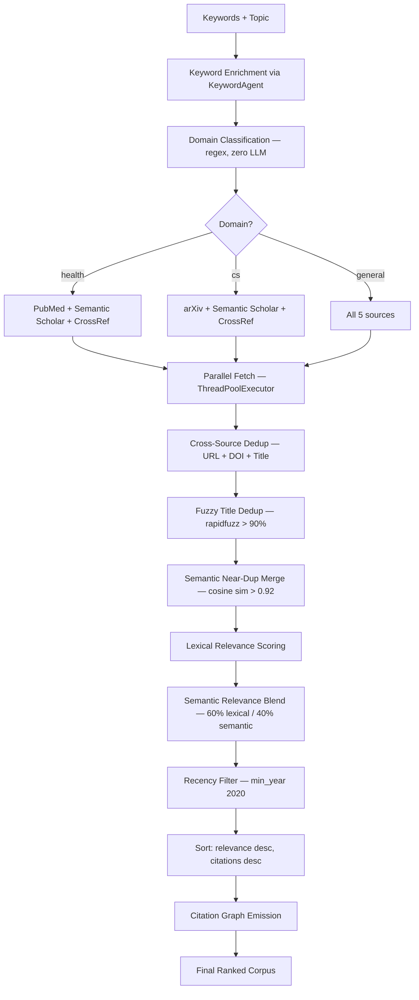
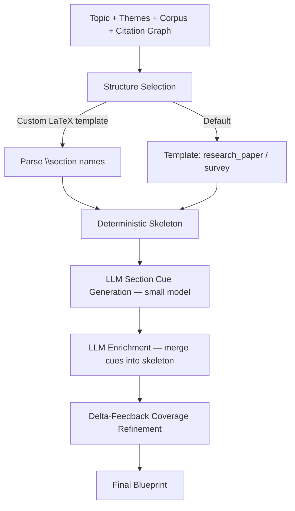
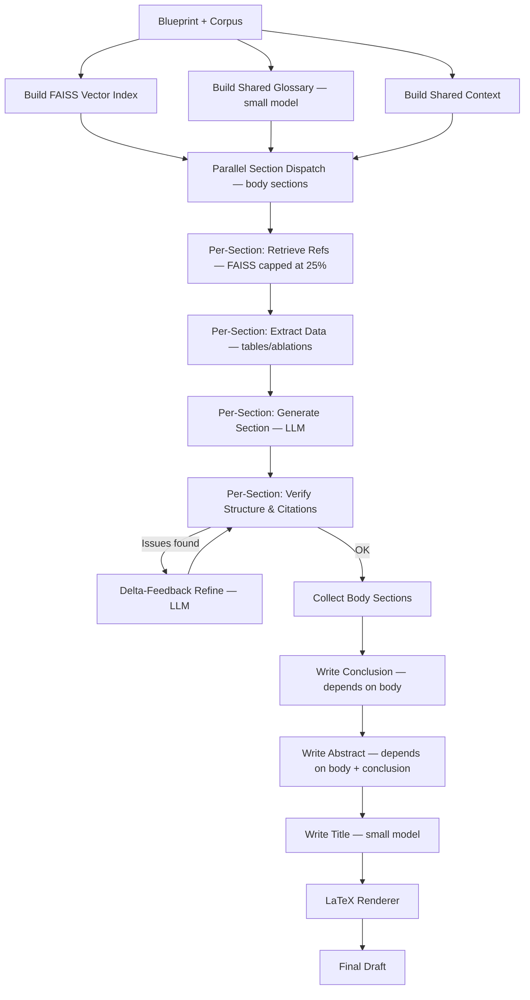
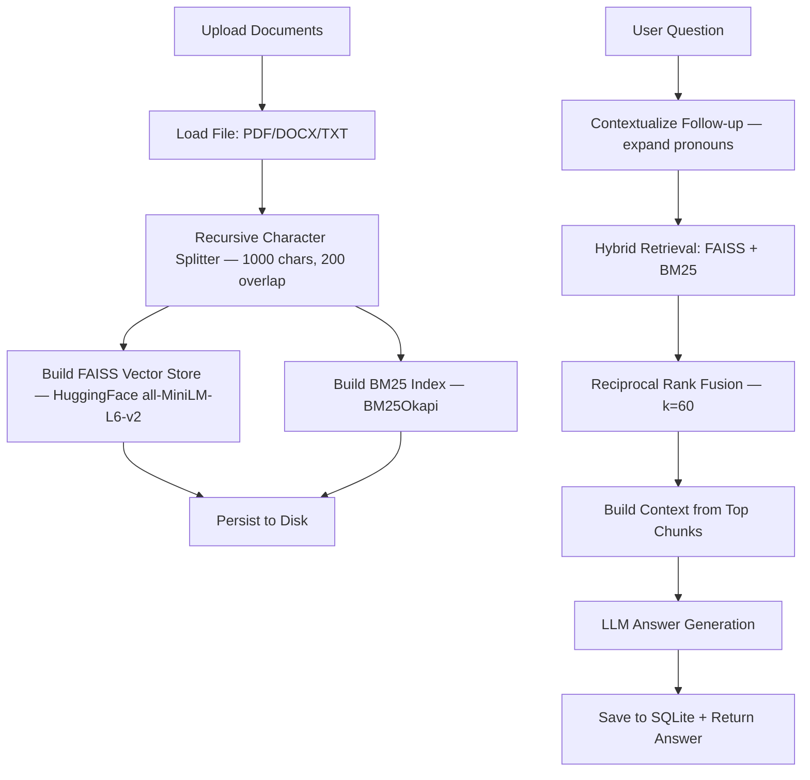
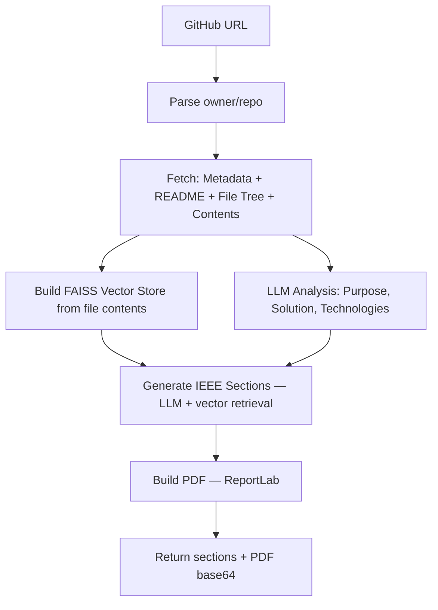
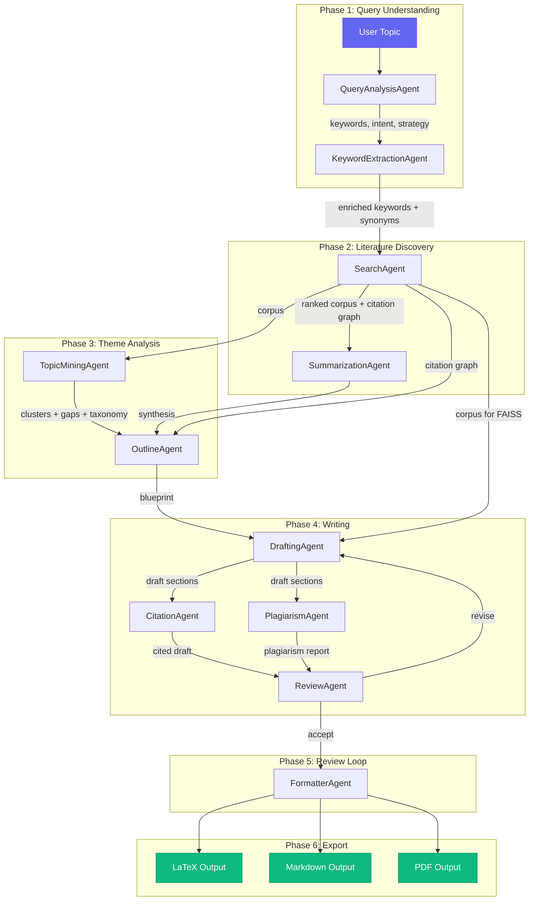

# 🧠 Agent Architecture — AI Research Paper Writing Assistant

> **A deep-dive into every agent in the multi-agent pipeline: architecture, working, prompts, inputs/outputs, and data flow.**

---

## Table of Contents

1. [System Overview](#system-overview)
2. [LLM Provider (Shared Infrastructure)](#1-llm-provider-shared-infrastructure)
3. [Query Analysis Agent](#2-query-analysis-agent)
4. [Keyword Extraction Agent](#3-keyword-extraction-agent)
5. [Search Agent](#4-search-agent)
6. [Summarization Agent](#5-summarization-agent)
7. [Topic Mining Agent](#6-topic-mining-agent)
8. [Outline Agent](#7-outline-agent)
9. [Drafting Agent](#8-drafting-agent)
10. [Citation Agent](#9-citation-agent)
11. [Plagiarism Detection Agent](#10-plagiarism-detection-agent)
12. [Review Agent](#11-review-agent)
13. [Formatter Agent](#12-formatter-agent)
14. [Diagram Agent](#13-diagram-agent)
15. [Pseudocode Agent](#14-pseudocode-agent)
16. [RAG Agent](#15-rag-agent)
17. [GitHub Paper Agent](#16-github-paper-agent)
18. [Pipeline Data Flow](#pipeline-data-flow)

---

## System Overview

The system is a **multi-agent pipeline** where each agent handles a specific stage of research paper generation. Agents communicate through well-defined data contracts (Python dictionaries) and gracefully degrade when LLM providers are unavailable — every agent has a **deterministic heuristic fallback** so the pipeline always produces a complete output.



### LLM Provider Priority Chain

All agents use a shared provider priority:

```
Ollama (local/cloud, FREE) → Groq (API key) → Gemini (API key) → None (heuristic fallback)
```

---

## 1. LLM Provider (Shared Infrastructure)

**File:** [`llm_provider.py`](../backend/core_agents/llm_provider.py)

### Architecture

The LLM provider is the backbone of the system — a **unified interface** that wraps three LLM providers behind a single `chat_completion()` function. All agents call this function instead of directly calling provider APIs.

### Working

1. Builds a `messages` array from the `system` and `prompt` parameters
2. Tries **Ollama** first (OpenAI-compatible or native cloud API)
3. Falls back to **Groq** (via the Groq Python SDK)
4. Falls back to **Gemini** (via the Google GenAI SDK)
5. Returns `None` if all three fail — agents then use heuristic fallbacks

### Key Function Signature

```python
def chat_completion(
    prompt: str,
    *,
    system: Optional[str] = None,
    max_tokens: int = 400,
    temperature: float = 0.3,
    top_p: float = 0.9,
    groq_model: str = "llama-3.3-70b-versatile",
    gemini_model: str = "gemini-2.0-flash-exp",
) -> Optional[str]
```

### Environment Variables

| Variable | Purpose |
|---|---|
| `OLLAMA_BASE_URL` | Ollama API endpoint (default: `http://localhost:11434/v1`) |
| `OLLAMA_MODEL` | Local model name (default: `llama3.2`) |
| `OLLAMA_API_KEY` | API key for Ollama Cloud |
| `GROQ_API_KEY` | Groq API key |
| `GEMINI_API_KEY` | Google Gemini API key |

---

## 2. Query Analysis Agent

**File:** [`query_agent.py`](../backend/core_agents/query_agent.py)  
**Class:** `QueryAnalysisAgent` (alias: `ScientificQueryAgent`)

### Architecture

The first agent in the pipeline. It analyzes the user's research topic and produces **enriched search metadata** that drives all downstream agents.

### Working Pipeline



1. **Intent Classification** — classifies the query into one of: `informational`, `comparative`, `methodological`, `survey`, `implementation`
2. **Keyword Extraction** — delegates to the `KeywordExtractionAgent` for hybrid keyword extraction
3. **Query Decomposition** — breaks complex queries into 1–3 simpler sub-queries
4. **Subtopic Expansion** — maps each keyword to semantically related peers using word overlap
5. **Synonym Generation** — generates academic synonyms for the top keywords
6. **Complexity Analysis** — estimates complexity based on lexical diversity, domain specificity, word count
7. **Search Strategy** — recommends `max_results`, `sources`, and whether to use multi-query retrieval

### Prompts

#### Intent Classification Prompt
```
You are a research query classifier.
Classify the following research topic into exactly one of these intents:
- informational: seeking facts, explanations, or overview
- comparative: comparing methods, models, or approaches
- methodological: seeking how-to, implementation details, or algorithmic steps
- survey: seeking comprehensive literature review or state-of-the-art
- implementation: seeking code, tools, or practical deployment guidance

Respond ONLY with a JSON object: {"intent": "informational", "confidence": 0.92}
Do not include markdown or explanations.

Topic: {text}
```

**System message:** `"You classify research queries. Respond ONLY with JSON."`  
**Parameters:** `max_tokens=80, temperature=0.1, top_p=0.9`

#### Query Decomposition Prompt
```
You are a research query decomposition assistant.
Break the following complex research topic into 1-3 simpler sub-queries
that would help retrieve comprehensive literature.

Rules:
- Each sub-query should be self-contained and search-friendly.
- Return ONLY a JSON object: {"sub_queries": ["sub query 1", "sub query 2"]}
- If the topic is already simple and focused, return a single sub-query identical to the original.
- No markdown, no explanations.

Topic: {text}
```

**System message:** `"You decompose research queries. Respond ONLY with JSON."`  
**Parameters:** `max_tokens=200, temperature=0.2, top_p=0.9`

#### Synonym Expansion Prompt
```
You are a scientific terminology assistant.
For each keyword below, suggest 2-4 scientific synonyms or alternative phrasings
used in academic literature.

Rules:
- Return ONLY a JSON object: {"synonyms": {"keyword1": ["alt1", "alt2"], ...}}
- Keep synonyms concise and academically relevant.
- No markdown, no explanations.

Keywords:
{keywords}
```

**System message:** `"You suggest scientific synonyms. Respond ONLY with JSON."`  
**Parameters:** `max_tokens=400, temperature=0.2, top_p=0.9`

### Output Contract

```python
{
    "original_topic": str,
    "keywords": List[str],
    "subtopics": Dict[str, List[str]],
    "complexity_analysis": {
        "word_count": int,
        "lexical_diversity": float,
        "domain_specificity_score": float,
        "estimated_complexity": "low" | "medium" | "high",
        "is_specific": bool,
        "scope": "narrow" | "broad" | "interdisciplinary",
        "recommended_papers": int,
    },
    "intent": str,
    "intent_confidence": float,
    "sub_queries": List[str],
    "synonyms": Dict[str, List[str]],
    "search_strategy": {
        "max_results": int,
        "use_multi_query": bool,
        "sources": List[str],
        "recommended_top_keywords": int,
    },
    "keyword_details": List[Dict],
    "elapsed_ms": int,
}
```

---

## 3. Keyword Extraction Agent

**File:** [`keyword_agent.py`](../backend/core_agents/keyword_agent.py)  
**Class:** `KeywordExtractionAgent`

### Architecture

A **hybrid keyword extraction** engine that combines LLM semantic understanding with fast embedding-based fallback (KeyBERT + `all-MiniLM-L6-v2`).

### Working Pipeline

1. **LLM Path** — uses the LLM to semantically extract domain-specific keywords with type tags (`core`, `method`, `domain`, `entity`)
2. **Embedding Path** — uses KeyBERT with maximal marginal relevance for diverse keyword extraction
3. **Merge & Rank** — merges both sets, giving LLM keywords a 5% score boost; averages scores for overlaps
4. **Post-processing** — filters domain stopwords, deduplicates near-duplicates, expands acronyms
5. **Synonym Generation** (optional) — asks the LLM for scientific synonyms

### Prompts

#### LLM Keyword Extraction Prompt
```
You are a scientific keyword extraction engine.
Extract the most relevant technical keywords and key phrases from the following
research query or text.

Rules:
- Focus on domain-specific terms, methods, entities, and concepts.
- Include multi-word phrases when they represent single concepts
  (e.g., "convolutional neural network").
- Expand any acronyms to their full form AND include the acronym itself.
- Exclude generic words like "paper", "study", "research", "method", "approach".
- Return ONLY a valid JSON object with this exact schema:
  {"keywords": [{"text": "...", "type": "core|method|domain|entity"}, ...]}
- Provide at most {top_n} keywords, ordered by relevance (most relevant first).
- Do not include markdown code blocks or explanations.

Text:
{text}
```

**System message:** `"You extract scientific keywords. Respond ONLY with JSON."`  
**Parameters:** `max_tokens=600, temperature=0.1, top_p=0.9`

### Output Contract

```python
{
    "keywords": [{"text": str, "score": float, "type": str}, ...],
    "synonyms": {"keyword": ["alt1", ...], ...} | None,
    "provider": "llm" | "embedding" | "hybrid" | "fallback",
    "elapsed_ms": int,
}
```

---

## 4. Search Agent

**File:** [`search_agent.py`](../backend/core_agents/search_agent.py)  
**Class:** `SearchAgent` (alias: `PaperRetrievalAgent`)

### Architecture

A **high-performance, multi-source paper retrieval engine** with domain-based routing, parallel fetching, multi-layer deduplication, citation-aware ranking, and Citation Graph emission.

### Data Sources

| Source | Domain Affinity | API |
|---|---|---|
| **arXiv** | CS / AI / Physics | `arxiv` Python library |
| **PubMed** | Health / Medicine / Biology | NCBI E-utilities (free) |
| **OpenAlex** | General academic | REST API |
| **Semantic Scholar** | General + citations | REST API |
| **CrossRef** | Cross-discipline + references | REST API |

### Working Pipeline



### Prompts

This agent uses **no LLM calls**. Domain classification is purely regex-based for speed. Relevance scoring is lexical + embedding (sentence-transformers).

### Domain Classification Regex

- **Health domain:** matches terms like `sleep`, `anxiety`, `diabetes`, `clinical`, `patient`, `vaccine`, etc.
- **CS domain:** matches terms like `algorithm`, `neural network`, `deep learning`, `transformer`, `LLM`, etc.

### Output Contract

```python
{
    "papers": [
        {
            "title": str,
            "authors": List[str],
            "authors_str": str,
            "abstract": str,
            "published": str,       # YYYY-MM-DD
            "pdf_url": str,
            "entry_id": str,
            "categories": List[str],
            "source": "arxiv" | "openalex" | "semantic_scholar" | "pubmed" | "crossref",
            "doi": str,
            "url": str,
            "citations": int,
            "relevance_score": float,
            "provenance": Dict,
        }, ...
    ],
    "domain": "health" | "cs" | "general",
    "source_status": Dict[str, str],
    "total": int,
    "citation_graph": Dict,
    "warnings": List[str],
}
```

---

## 5. Summarization Agent

**File:** [`summarization_agent.py`](../backend/core_agents/summarization_agent.py)  
**Class:** `PaperSummarizationAgent`

### Architecture

A **fast, LLM-powered paper synthesizer** that uses an abstract-first strategy with parallel PDF fallback and single-pass LLM synthesis.

### Working Pipeline

1. **Text Gathering** — uses paper abstracts if ≥300 chars; downloads PDFs in parallel for papers with short abstracts
2. **LLM Single-Pass Synthesis** — one LLM call generates the full structured synthesis
3. **Heuristic Fallback** — keyword-scoring sentence extraction when no LLM is available

### Prompts

#### Main Summary Prompt
```
You are an expert academic research synthesizer.
Read the following paper abstracts and produce a structured synthesis.

Rules:
- Use ONLY the information provided in the abstracts.
- Do NOT invent facts, citations, or paper titles.
- Respond ONLY with valid JSON matching the schema below.
- Keep summaries concise, factual, and academically neutral.

Schema:
{
  "executive_summary": "2-3 paragraph overview of the collective research",
  "section_summaries": {
    "Research Context and Background": "...",
    "Methodological Approaches": "...",
    "Key Findings and Results": "...",
    "Analysis and Discussion": "...",
    "Conclusions and Future Directions": "..."
  },
  "key_insights": {
    "methodological_approaches": ["...", "..."],
    "major_findings": ["...", "..."],
    "innovative_contributions": ["...", "..."],
    "practical_applications": ["...", "..."],
    "limitations_challenges": ["...", "..."]
  },
  "research_gaps": ["...", "...", "..."],
  "synthesis": "1 paragraph final synthesis statement"
}

Keywords: {keywords}

Papers:
{papers}

Return ONLY the JSON object, no markdown fences or explanations.
```

**System message:** `"You synthesize academic research. Respond ONLY with JSON."`  
**Parameters:** `max_tokens=2500, temperature=0.2, top_p=0.9`

#### Fallback Summary Prompt (used when JSON synthesis fails)
```
Summarize the following research abstracts into a concise academic synthesis.

Keywords: {keywords}

Abstracts:
{abstracts}

Provide:
1. Executive Summary (2 paragraphs)
2. Methodological Approaches (1 paragraph)
3. Key Findings (1 paragraph)
4. Research Gaps (bullet list)
5. Final Synthesis (1 paragraph)
```

### Output Contract

```python
{
    "executive_summary": str,
    "section_summaries": Dict[str, str],
    "key_insights": {
        "methodological_approaches": List[str],
        "major_findings": List[str],
        "innovative_contributions": List[str],
        "practical_applications": List[str],
        "limitations_challenges": List[str],
    },
    "research_gaps": List[str],
    "synthesis": str,
    "metadata": {
        "total_papers": int,
        "papers_with_full_text": int,
        "keywords": List[str],
        "analysis_date": str,
        "papers_analyzed": List[Dict],
    },
}
```

---

## 6. Topic Mining Agent

**File:** [`topic_mining_agent.py`](../backend/core_agents/topic_mining_agent.py)  
**Class:** `TopicMiningAgent`

### Architecture

Clusters the retrieved corpus into **themes/taxonomy** and surfaces **coverage gaps**. Its output feeds the Outline Agent's structure planning.

### Working Pipeline

1. **SLM Attribute Extraction** — uses a small LLM to extract 3 attributes per paper:
   - `core_methodology`
   - `primary_problem_domain`
   - `key_contribution`
2. **Embedding** — embeds focused text (from step 1 or raw title+abstract) with `all-MiniLM-L6-v2`
3. **Clustering** — HDBSCAN for large corpora (≥25 papers), KMeans otherwise
4. **Labeling** — TF-IDF-based cluster labels from top-scoring terms
5. **Coverage Gap Detection** — finds subtopics not covered by any cluster (cosine similarity < 0.35)

### Prompts

#### SLM Attribute Extraction Prompt (per paper)
```
You are a scientific abstract analyzer. Bypass syntactic noise and extract
EXACTLY three attributes. Output ONLY a JSON object, no prose.

Abstract:
"""{text}"""

Return JSON with EXACTLY these keys (each a concise phrase <= 12 words):
{"core_methodology": "...", "primary_problem_domain": "...", "key_contribution": "..."}
```

**Parameters:** `max_tokens=200, temperature=0.1`

### Output Contract

```python
{
    "clusters": [
        {
            "id": int,
            "theme": str,
            "keywords": List[str],
            "size": int,
            "representative": str,    # paper title closest to centroid
            "papers": List[str],
            "centroid": List[float],
        }, ...
    ],
    "taxonomy": List[str],
    "gaps": List[str],
    "method": "kmeans" | "hdbscan" | "subtopic_fallback",
    "metrics": {
        "method": str,
        "n_clusters": int,
        "silhouette": float | None,
        "n_papers": int,
        "attributes_extracted": bool,
    },
}
```

---

## 7. Outline Agent

**File:** [`outline_agent.py`](../backend/core_agents/outline_agent.py)  
**Class:** `OutlineAgent`

### Architecture

Produces the **JSON Blueprint** that drives the Drafting Agent. It follows a deterministic-skeleton-first approach: a valid blueprint is always produced, then LLM output is layered on top.

### Working Pipeline



### Section Templates

**Research Paper:**
| Section | Role | Target Words |
|---|---|---|
| Abstract | front_matter | 200 |
| Introduction | macro_lit_review | 900 |
| Related Work | micro_lit_review | 800 |
| Methodology | body | 1000 |
| Experiments and Results | body | 1000 |
| Discussion | body | 800 |
| Conclusion | back_matter | 400 |

### Prompts

#### Section Cue Generation Prompt (small model)
```
You are planning an academic paper on: "{topic}".
Discovered themes: {theme_list}
Known gaps: {gap_list}
For EACH section below, give 2-3 short writing cues (imperative phrases).
Sections: {section_names}
Return ONLY JSON: an object mapping section name -> list of cue strings.
```

**Parameters:** `max_tokens=600, temperature=0.3`

### Delta-Feedback Coverage Refinement

After cue generation, the agent verifies:
- **Every theme** from Topic Mining is referenced somewhere in the blueprint → uncovered themes are added to the Related Work section
- **Every gap** is referenced → uncovered gaps are added as Discussion/Future Work cues

### Output Contract (Blueprint)

```python
{
    "topic": str,
    "target_venue": str,
    "output_type": "research_paper" | "survey" | "report",
    "title_hint": str,
    "sections": [
        {
            "name": str,
            "role": "front_matter" | "macro_lit_review" | "micro_lit_review" | "body" | "back_matter",
            "goal": str,
            "target_words": int,
            "subsections": [{"name": str, "cues": List[str], "target_words": int}],
            "citation_hints": [{"claim": str, "suggested_sources": List[str]}],
            "visualization_directives": [{"type": str, "description": str}],
        }, ...
    ],
    "themes": List[str],
    "gaps": List[str],
    "lit_review": {"macro": str, "micro": str},
    "meta": {"method": str, "revisions": int, "coverage": Dict},
}
```

---

## 8. Drafting Agent

**File:** [`drafting_agent.py`](../backend/core_agents/drafting_agent.py)  
**Class:** `DraftingAgent`

### Architecture

Turns the Outline Blueprint into a **submission-ready manuscript**. Implements parallel section dispatch with FAISS vector retrieval, data extraction, and verify-refine loops.

### Working Pipeline



### Model Routing

The agent uses **multiple SLM tiers**:
- **Small model:** Abstract, Conclusion, Title, Glossary (summarizing sections)
- **Large model:** Introduction, Methodology, Results, Discussion (substantive body sections)

### Prompts

#### Section Generation Prompt (per section)
```
You are writing ONE section of a single coherent academic paper on "{topic}".

Manuscript plan & context:
{context}

Write ONLY the '{name}' section (~{target} words).
Goal: {goal}
Writing cues: {cues}
Cover ONLY this section's scope — do NOT write content owned by other sections
(see the section plan above). Use formal academic prose and cite the sources
below by author/title where relevant.

Relevant sources:
{ref_block}

{experimental_data}
{review_feedback}

Return ONLY the section prose (no markdown headings).
```

**Parameters:** `max_tokens=min(2048, target*1.6 + 200), temperature=0.4`

#### Glossary Generation Prompt (small model)
```
List 6-12 key technical terms/acronyms (comma-separated, no prose) to use
consistently across a paper on '{topic}'.
Themes: {themes}. Sources: {titles}
```

**Parameters:** `max_tokens=120, temperature=0.2`

#### Title Generation Prompt (small model)
```
Propose a concise academic paper title for work on "{topic}".
Return ONLY the title text.
```

**Parameters:** `max_tokens=40, temperature=0.5`

#### Refinement Prompt (when verify finds issues)
```
Revise the following '{section_name}' section to fix these issues: {issues}.
Where relevant, cite: {ref_block}.
Keep the academic tone. Return ONLY the revised prose.

{text}
```

**Parameters:** `max_tokens=1800, temperature=0.4`

### Output Contract

```python
{
    "title": str,
    "sections": Dict[str, str],   # {section_name: text}
    "latex": str,
    "section_meta": {
        section_name: {
            "words": int,
            "refs_used": List[str],
            "verified": bool,
            "issues": List[str],
        }
    },
    "references_used": List[Dict],
    "ordering": List[str],
    "method": "llm" | "deterministic",
}
```

---

## 9. Citation Agent

**File:** [`citation_agent.py`](../backend/core_agents/citation_agent.py)  
**Class:** `CitationAgent`

### Architecture

An **intelligent citation engine** that analyzes generated draft text, identifies where citations are needed, matches claims with relevant papers, and adds proper academic citations (APA, IEEE, MLA).

### Working Pipeline

1. **Extract Citation Needs** — scans each sentence for academic indicators (e.g., "previous research", "shows", "proposed method")
2. **Find Relevant Citations** — TF-IDF + keyword overlap matching against retrieved papers
3. **Format Citations** — formats in-text citations and reference entries in the chosen style
4. **Grounding Gate** — audits every factual/numeric/comparison claim for provenance; blocks ungrounded claims from export

### Citation Need Detection Keywords

The agent looks for these patterns in sentences:
- **Claims about findings:** `show`, `demonstrated`, `proven`, `found`
- **Referential language:** `previous`, `existing`, `literature`, `research`
- **Citation indicators:** `according to`, `based on`, `reported`, `proposed`
- **Comparative language:** `similar`, `comparable`, `different`, `contrast`
- **Methods/approaches:** `method`, `approach`, `technique`, `algorithm`
- **General claims:** `typically`, `commonly`, `generally`, `traditionally`

### Supported Citation Styles

| Style | In-Text Format | Reference Format |
|---|---|---|
| **IEEE** | `[1]` | `[1] Author, "Title," Journal, Year.` |
| **APA** | `(Author, 2024)` | `Author, F. (Year). Title. Journal. DOI` |
| **MLA** | `(Author page)` | `Author. "Title." Journal, Year, Pages.` |

### Grounding Gate

The grounding gate ensures **factual integrity** before export:

```python
# Claims that MUST be grounded:
# 1. Contain numbers or percentages (e.g., "achieves 95% accuracy")
# 2. Contain comparison terms (e.g., "outperforms", "state-of-the-art", "best")
```

### Prompts

This agent uses **no LLM calls**. All matching is done via TF-IDF cosine similarity and keyword overlap.

### Output Contract

```python
{
    "cited_draft": Dict[str, str],     # sections with [N] citations inserted
    "citations_added": int,
    "references": List[Dict],
    "citation_map": Dict[str, Dict],
    "full_draft": str,                 # assembled markdown
    "grounding": {                     # from ground_draft()
        "total_claims": int,
        "grounded": int,
        "blocked": List[Dict],
        "grounded_ratio": float,
        "export_ready": bool,
    },
}
```

---

## 10. Plagiarism Detection Agent

**File:** [`plagiarism_agent.py`](../backend/core_agents/plagiarism_agent.py)  
**Class:** `PlagiarismDetectionAgent`

### Architecture

Detects plagiarism by comparing generated drafts against source papers using **sentence-level semantic similarity** with `all-MiniLM-L6-v2` embeddings and cosine similarity.

### Working Pipeline

1. **Extract Source Content** — splits source paper abstracts/text into sentences
2. **Analyze Each Section** — for every sentence in the draft:
   - Encode with sentence-transformer
   - Compare against all source sentences (batched)
   - Flag if similarity ≥ 30%
3. **Classify Severity** — `< 30%`: Good, `30-50%`: Moderate, `> 50%`: High
4. **Generate Suggestions** — paraphrasing strategies for flagged sentences

### Thresholds

| Level | Threshold | Status |
|---|---|---|
| Good | < 30% | Acceptable |
| Moderate | 30% – 50% | Review recommended |
| High | > 50% | Rewrite required |

### Prompts

This agent uses **no LLM calls**. All detection is via semantic embeddings (sentence-transformers) and cosine similarity (scikit-learn).

### Output Contract

```python
{
    "metadata": {
        "research_topic": str,
        "analysis_date": str,
        "source_papers_count": int,
        "total_source_sentences": int,
    },
    "overall_score": float,           # percentage
    "overall_status": "good" | "moderate" | "high_plagiarism",
    "overall_message": str,
    "statistics": {
        "total_sentences": int,
        "sentences_flagged": int,
        "percentage_flagged": float,
    },
    "section_analyses": [
        {
            "section_name": str,
            "plagiarism_score": float,
            "flagged_sentences": List[Dict],
            "status": str,
        }, ...
    ],
}
```

---

## 11. Review Agent

**File:** [`review_agent.py`](../backend/core_agents/review_agent.py)  
**Class:** `ReviewAgent`

### Architecture

An **independent multi-critic peer reviewer** that simulates a panel of specialized academic reviewers. Each critic scores a different axis, and the results feed the revision loop.

### Critics Panel

| Critic | Score | Method |
|---|---|---|
| **Novelty Evaluator** | /10 | LLM or gap-coverage heuristic |
| **Coherence Checker** | /10 | LLM or section-evenness heuristic |
| **Evidence Quality** | /10 | LLM or citation-presence heuristic |
| **Writing & Reproducibility** | /10 | LLM or structure-based heuristic |
| **Originality** | /10 | Plagiarism agent score (inverse of overlap) |
| **Logical Consistency** | flags | LLM or none (heuristic unreliable) |
| **Unsupported Claim Detector** | H/M/L | Regex for numbers + comparatives without citations |

### Working Pipeline

1. **Parallel Critic Scoring** — all LLM-based critics run concurrently
2. **Originality from Plagiarism** — `originality = (1 - overlap) × 10`
3. **Logical Consistency** — LLM identifies internal contradictions
4. **Unsupported Claims** — regex detects factual claims without citations
5. **Per-Section Review** — each section individually scored by small model
6. **Aggregation** — mean score, critical issues, recommendation

### Prompts

#### Scoring Critic Prompt Template
```
You are a strict academic peer reviewer. {instruction}
Paper topic: {topic}
Manuscript (excerpt):
{full_text}
Return ONLY JSON: {"score": <0-10 number>, "justification": "<one sentence>"}.
```

**Instructions per critic:**
- **Novelty:** `"Score the NOVELTY of the contribution (0-10): how original vs. prior work."`
- **Coherence:** `"Score COHERENCE and logical flow across sections (0-10)."`
- **Evidence Quality:** `"Score EVIDENCE QUALITY: are claims grounded in cited sources (0-10)?"`
- **Writing:** `"Score WRITING quality and REPRODUCIBILITY (methodology detail) (0-10)."`

**Parameters:** `max_tokens=200, temperature=0.2`

#### Logical Consistency Prompt
```
Identify any internal contradictions or logically inconsistent claims in
this manuscript on '{topic}'.
{full_text}
Return ONLY JSON: {"contradictions": ["<short description>", ...]}.
Empty list if none.
```

#### Per-Section Review Prompt (small model)
```
You are a meticulous academic section reviewer. Output ONLY JSON.
Section "{name}". Text:
"""{text}"""
Return {"score": 0-10, "issues": ["..."]} judging clarity,
grounding in cited sources, and completeness.
```

### Recommendation Logic

| Condition | Recommendation |
|---|---|
| `has_critical` AND `mean_score < 5.5` | `reject` |
| `has_critical` | `revise` |
| `mean_score >= 8.0` | `accept` |
| `mean_score >= threshold - 0.5` | `weak_accept` |
| otherwise | `revise` |

### Output Contract

```python
{
    "scores": Dict[str, float],
    "logical_consistency": {"contradictions": List[str]},
    "unsupported_claims": List[{"section": str, "claim": str, "severity": "H"|"M"|"L"}],
    "section_reviews": List[{"section": str, "score": float, "issues": List[str]}],
    "mean_score": float,
    "has_critical_issues": bool,
    "major_concerns": List[str],
    "recommendation": "accept" | "weak_accept" | "revise" | "reject",
    "critique": Dict[str, List[str]],
    "plagiarism": Dict,
    "method": "llm" | "heuristic",
}
```

---

## 12. Formatter Agent

**File:** [`formatter_agent.py`](../backend/core_agents/formatter_agent.py)  
**Class:** `FormatterAgent`

### Architecture

Assembles the **final exportable artifact** from the cited draft + blueprint. Produces LaTeX, Markdown, and consolidated references.

### Working Pipeline

1. **Resolve Sections** — prefers cited section text over raw draft
2. **Extract References** — from the citation result or drafting agent
3. **Collect Figures** — gathers visualization directives from the blueprint
4. **Render Diagrams** (optional) — generates Mermaid code via DiagramAgent
5. **Render LaTeX** — IEEE or article document class, with figure/table floats
6. **Render Markdown** — clean markdown with sections, figures, and references

### Prompts

This agent uses **no LLM calls** in the default path. Diagram generation is optional.

### Output Contract

```python
{
    "title": str,
    "output_type": str,
    "target_venue": str,
    "sections": Dict[str, str],
    "references": List[str],
    "figures": List[Dict],
    "formats": {
        "latex": str,
        "markdown": str,
    },
    "export_ready": bool,
    "grounding": Dict,
    "review": Dict,
}
```

---

## 13. Diagram Agent

**File:** [`diagram_agent.py`](../backend/core_agents/diagram_agent.py)  
**Class:** `DiagramAgent`

### Architecture

Converts text descriptions into **Mermaid.js diagram code**. Supports flowcharts, sequence diagrams, Gantt charts, ER diagrams, and more.

### Working

Tries providers in order: **Ollama → Gemini → Groq**

### Prompt

```
You are an expert system architect and diagram designer.
Convert the following text description into a valid Mermaid.js diagram code.

Instruction:
- Use the best suited diagram type (flowchart, sequence, class, state,
  entityRelationship, gantt, pie, flowchart TD, etc.)
- Diagram Type Hint: {diagram_type}
- Only output the Mermaid code block.
- Do not include any explanations or conversational text.
- Ensure syntax is correct and follows Mermaid.js standards.
- If the description implies hierarchy, use top-down or left-to-right flowcharts.

Text Description:
{description}

Mermaid Code:
```

**Parameters:** `temperature=0.2, top_p=0.9, max_tokens=2048`

### Output Contract

```python
{
    "success": bool,
    "mermaid_code": str,
    "provider": "ollama" | "gemini" | "groq",
    "diagram_type": str,
}
```

---

## 14. Pseudocode Agent

**File:** [`pseudocode_agent.py`](../backend/core_agents/pseudocode_agent.py)  
**Class:** `PseudocodeAgent`

### Architecture

Converts implementation code (Python, C++, Java, etc.) into **professional LaTeX pseudocode** using the `algorithm2e` package.

### Working

Tries providers in order: **Ollama → Gemini → Groq**

### Prompt

```
You are an expert Academic Editor for Computer Science research papers
(IEEE/ACM standard).
Your goal is to convert raw implementation code (Python, C++, Java, etc.)
into professional, mathematical pseudocode formatted for LaTeX using the
'algorithm2e' package.

### INSTRUCTIONS:
1.  **Analyze the Logic:** Identify specific loop structures, conditionals,
    and core logic. Ignore boilerplate (imports, print statements, logging,
    error handling).
2.  **Mathematical Notation:**
    - Replace assignment `=` with $\leftarrow$.
    - Replace logic `==` with $=$, `!=` with $\neq$.
    - Use mathematical symbols for variables where standard (e.g., use $n$
      instead of `len(arr)`, use $\sum$ instead of `total_sum`, use $\eta$
      for learning rate).
3.  **Formatting Rules:**
    - Use the `algorithm2e` package syntax: `\For`, `\If`, `\While`,
      `\KwData`, `\KwResult`.
    - Ensure all math variables are enclosed in `$` signs.
    - Add meaningful comments using `\tcc{comment}` if the logic is complex.
4.  **Output Constraint:**
    - Return ONLY the raw LaTeX code block.
    - Do NOT wrap the output in markdown code blocks (like ```latex ... ```).
    - Do NOT write introductions ("Here is your code...") or conclusions.

### EXAMPLE INPUT:
def find_max(arr):
    max_val = arr[0]
    for i in range(1, len(arr)):
        if arr[i] > max_val:
            max_val = arr[i]
    return max_val

### EXAMPLE OUTPUT:
\begin{algorithm}
\caption{Find Maximum Value}
\KwData{Array $A$ of size $n$}
\KwResult{Maximum value $m$}
$m \leftarrow A[0]$\;
\For{$i \leftarrow 1$ \KwTo $n-1$}{
    \If{$A[i] > m$}{
        $m \leftarrow A[i]$\;
    }
}
\Return{$m$}\;
\end{algorithm}
```

**Parameters:** `temperature=0.1, top_p=0.95, max_tokens=2048`

### Output Contract

```python
{
    "success": bool,
    "latex_code": str,
    "provider": "ollama" | "gemini" | "groq",
    "algorithm_name": str,
}
```

---

## 15. RAG Agent

**File:** [`rag_agent.py`](../backend/core_agents/rag_agent.py)  
**Class:** `RAGAgent`

### Architecture

A **production-grade document Q&A system** with multi-format ingestion, hybrid retrieval, conversational memory, and SQLite-backed session persistence.

### Features

- **Multi-format ingestion:** PDF (PyMuPDF with reading-order), DOCX, TXT
- **Hybrid retrieval:** FAISS vector search + BM25 keyword search
- **Reciprocal Rank Fusion (RRF):** combines vector + keyword results
- **Conversational memory:** full chat history in SQLite
- **Follow-up contextualization:** expands short/pronoun-y follow-up questions
- **Session persistence:** FAISS indexes survive server restarts (saved to disk)

### Working Pipeline



### Prompt (Q&A)

```
You are a highly knowledgeable research assistant analyzing uploaded documents.
Your goal is to provide accurate, well-structured, and contextual answers based
ONLY on the provided document context. If the answer cannot be found in the
context, say so clearly.

RULES:
1. Base your answer strictly on the provided context
2. Cite sources by mentioning the document name and page number when available
3. If the context is insufficient, acknowledge what you do know and what's missing
4. Use clear, academic language
5. Structure long answers with bullet points or numbered lists when appropriate
6. Consider the conversation history for context continuity

CONVERSATION HISTORY:
{history}

RETRIEVED DOCUMENT CONTEXT:
{context}

USER QUESTION: {question}

Provide a comprehensive, well-structured answer:
```

**Parameters:** `max_tokens=1500, temperature=0.2`

---

## 16. GitHub Paper Agent

**File:** [`github_paper_agent.py`](../backend/core_agents/github_paper_agent.py)  
**Class:** `GitHubPaperAgent`

### Architecture

Fetches a GitHub repository, analyzes its contents via LLM, and generates a structured **IEEE-format research paper** with PDF output.

### Working Pipeline



### Prompts

#### Repository Analysis Prompt
```
Analyze this GitHub repository for academic paper generation.

Name: {name}
Description: {description}
Languages: {languages}
README (first 2000 chars):
{readme}

File listing:
{files}

Return ONLY valid JSON (no markdown, no explanation) with these keys:
SYSTEM_PURPOSE, PROPOSED_SOLUTION, KEY_TECHNOLOGIES (array of strings),
PROJECT_TYPE, ARCHITECTURE, INNOVATION, TARGET_DOMAIN, SCALABILITY
```

**Parameters:** `model=llama-3.1-8b-instant, max_tokens=1024, temperature=0.2`

#### Section Generation Prompt (per section)
```
Write an IEEE-style {name} section (~{words} words).

Formatting rules (IMPORTANT):
- Output plain academic prose only — NO markdown, asterisks, backticks, or headings.
- Do NOT repeat the section name or add a header.
- Do NOT begin with preamble like "Here is" or "Sure".
- Separate paragraphs with a blank line.

Project analysis:
- Purpose: {purpose}
- Solution: {solution}
- Technologies: {technologies}

Source code context:
{context}
```

**Parameters:** `model=llama-3.3-70b-versatile, max_tokens=words*2, temperature=0.25`

### Output Contract

```python
{
    "sections": {
        "title": str,
        "abstract": str,
        "introduction": str,
        "methodology": str,
        "implementation": str,
        "results": str,
        "conclusion": str,
        "references": str,
    },
    "pdf_base64": str,
    "repo_name": str,
    "analysis": Dict,
}
```

---

## Pipeline Data Flow

The complete end-to-end data flow for research paper generation:



### Data Contract Summary

| From → To | Data Passed |
|---|---|
| QueryAgent → KeywordAgent | Raw text, `top_n` setting |
| QueryAgent → SearchAgent | `keywords`, `synonyms`, `search_strategy` |
| SearchAgent → SummarizationAgent | `papers[]` with abstracts |
| SearchAgent → TopicMiningAgent | `papers[]` corpus |
| SearchAgent → OutlineAgent | `citation_graph` |
| TopicMiningAgent → OutlineAgent | `clusters`, `gaps`, `taxonomy` |
| SummarizationAgent → OutlineAgent | `synthesis` context |
| OutlineAgent → DraftingAgent | `blueprint` (sections, cues, targets) |
| SearchAgent → DraftingAgent | `corpus` (for FAISS index) |
| DraftingAgent → CitationAgent | `draft_sections` + `retrieved_papers` |
| DraftingAgent → PlagiarismAgent | `draft_sections` + `source_papers` |
| CitationAgent → ReviewAgent | `cited_draft` + `grounding` |
| PlagiarismAgent → ReviewAgent | `plagiarism_report` |
| ReviewAgent → DraftingAgent | `major_concerns` (for revision) |
| ReviewAgent → FormatterAgent | `review` scores + recommendation |
| FormatterAgent → Export | LaTeX, Markdown, PDF |

---

*Last updated: 2026-06-21*
